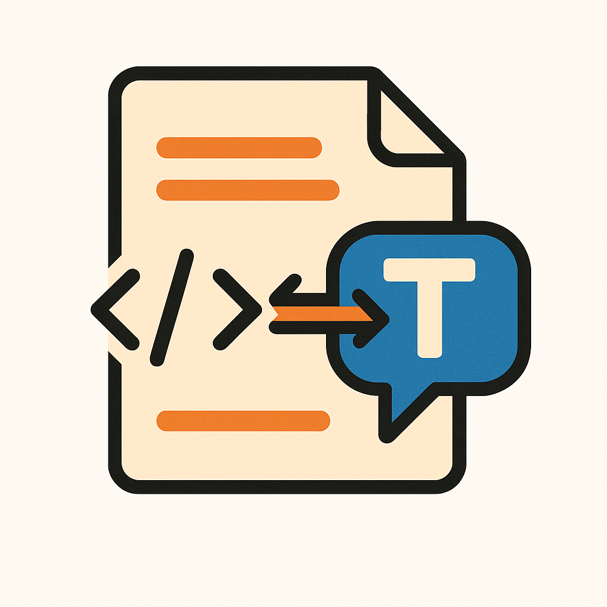
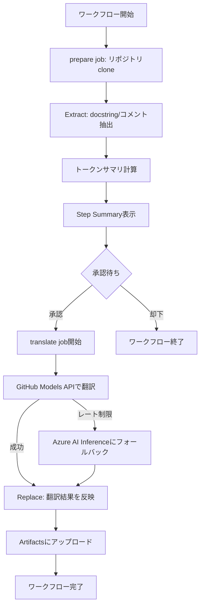

# translate-oss-docstring-actions

<div align="center">
  
</div>

## Overview

このリポジトリは、任意のPythonプロジェクトのdocstring・コメント・ログメッセージをLLMで翻訳し、翻訳結果を元のソースコードに反映させるGitHub Actionsワークフローを提供します。

GitHub Actionsワークフローを使って、OSSのPythonコードに含まれるdocstringやコメントを日本語化するツールです。

**主な特徴:**
- GitHub Actionsで完結（ローカル環境不要）
- 承認フローによる翻訳実行の制御
- 抽出・翻訳・反映の3ステップパイプライン
- GitHub Models / Azure AI Inferenceに対応
- トークン数とコストの事前確認
- libcstベースの正確なAST解析・置換
- **実質無料**: GitHub Modelsを使用することで無料でLLMを利用可能

**想定ユースケース:**
- 海外OSSの理解を深めるための日本語化
- ドキュメントが英語のみのライブラリの学習支援

## How It Works

### 処理

```
1. Extract (抽出)
   ├─ libcstでPythonコードをAST(抽象構文木)に解析
   ├─ docstring・コメント・ログメッセージをトラバース
   └─ 位置情報・メタデータと共にJSONL形式で出力
   
2. Translate (翻訳)
   ├─ バッチ単位でLLM APIに送信
   ├─ Primary: GitHub Models (無料)
   ├─ Fallback: Azure AI Inference (レート制限時)
   └─ 翻訳結果をJSONL形式で出力
   
3. Replace (反映)
   ├─ 元のソースコードをlibcstで再解析
   ├─ 位置情報を元に翻訳テキストを正確に差し込み
   └─ インデント・改行を保持したまま新規ファイルとして出力
```

### GitHub Modelsによる無料LLM利用

このツールは[GitHub Models](https://docs.github.com/ja/github-models)を利用して、無料枠を有効に利用してLLM翻訳を実行できます。

**Models:**
- Primary: `gpt-4.1`
- Secondary: `gpt-4.1-mini`
- Fallback: Azure AI Inference (`gpt-4.1-mini`がデフォルト)

**GitHub Models Rate Limit:**

かなり少なめ

| プラン | モデル | RPM | RPD | Input/Output トークン | 同時実行数 |
|--------|--------|-----|-----|---------------------|------------|
| **Copilot Free** | `openai/gpt-4.1` | 10 | 150 | 8,000 / 4,000 | 2 |
| **Copilot Free** | `openai/gpt-4.1-mini` | 15 | 150 | 8,000 / 4,000 | 5 |
| **Copilot Pro** | `openai/gpt-4.1` | 10 | 150 | 8,000 / 4,000 | 2 |
| **Copilot Pro** | `openai/gpt-4.1-mini` | 15 | 150 | 8,000 / 4,000 | 5 |

※ RPM: Requests Per Minute, RPD: Requests Per Day  
※ 同時実行数は本ツールで設定している制限値です

**コスト最適化の仕組み:**
1. **Primary**: まず`openai/gpt-4.1`で翻訳を試行（高精度、RPM: 10）
2. **Secondary**: レート制限に達したら`openai/gpt-4.1-mini`に切り替え（高速・大容量、RPM: 15）
3. **Fallback**: それでも制限に達した場合、Azure AI Inferenceに自動フォールバック

このため、**環境変数でAzure AI Inferenceの設定を行っておく**ことで、レート制限に達した場合でも継続的に翻訳処理を実行できます。

### GitHub Actions ワークフロー

`.github/workflows/translate.yml`が本番用ワークフローです。以下の流れで実行されます:

```
1. prepare job
   ├─ 対象リポジトリをclone
   ├─ docstring/コメントを抽出
   ├─ トークン数サマリを計算
   └─ Step Summaryに統計情報を表示
   
2. 承認待ち (translation-approval environment)
   ├─ トークン数・翻訳件数・推定時間を確認
   └─ GitHub UIで承認ボタンをクリック
   
3. translate job
   ├─ GitHub Models APIで翻訳を実行
   ├─ レート制限時はAzure AI Inferenceにフォールバック
   ├─ 翻訳結果を元のソースに反映
   └─ 成果物をArtifactsにアップロード
```

**承認フローの利点:**
- 翻訳前にトークン数・コストを確認できる
- 意図しない大量実行を防止

## Requirements

- Python 3.12以上
- [uv](https://github.com/astral-sh/uv) パッケージマネージャ
- GitHub Token（GitHub Models使用時）または Azure AI Inference APIキー

## Project Structure

```
.
├── .github/workflows/       # GitHub Actionsワークフロー定義
│   ├── translate.yml       # 本番翻訳ワークフロー（承認フロー付き）
│   └── translate-test-local.yml  # テスト用ワークフロー
├── src/                    # メインソースコード
│   ├── cli.py             # CLIエントリポイント
│   ├── extract.py         # docstring/コメント抽出
│   ├── translate.py       # LLM翻訳実行
│   ├── replace.py         # 翻訳結果の反映
│   ├── llm.py            # LLM API呼び出し
│   ├── log_utils.py      # 統一ログ出力
│   └── util.py           # 共通ユーティリティ
├── scripts/               # 補助スクリプト
│   └── summarize_tokens.py  # トークン数サマリ計算
├── tests/                 # テストコード
├── test_data/            # テスト用データ
├── main.py               # CLI実行エントリポイント
├── Makefile              # 開発用タスク定義
└── README.md             # このファイル
```

## Installation

### 1. 依存関係のインストール

```bash
uv sync
```

`uv.toml`でuvのキャッシュ先をローカル(`.uv-cache/`)に固定しています。権限が制限された環境でも動作するよう設定されています。

### 2. 環境変数の設定

#### GitHub Models を使用する場合（推奨・無料）

```bash
export GITHUB_TOKEN="ghp_your_token_here"
export GITHUB_MODELS_ENDPOINT="https://models.inference.ai.azure.com"
export GITHUB_MODELS_MODEL="openai/gpt-4.1"  # または openai/gpt-4.1-mini
```

GitHub Modelsは**無料**で利用できます。レート制限の詳細は[GitHub Models公式ドキュメント](https://docs.github.com/ja/github-models/use-github-models/prototyping-with-ai-models#rate-limits)を参照してください。

**注意**: `GITHUB_MODELS_MODEL`は実際には使用されません。内部的に`openai/gpt-4.1` → `openai/gpt-4.1-mini`の順で自動的にフォールバックします。

#### Azure AI Inference を使用する場合（Fallback用・オプション）

```bash
export AZURE_INFERENCE_ENDPOINT="https://your-endpoint.inference.ai.azure.com"
export AZURE_INFERENCE_CREDENTIAL="your_api_key"
export AZURE_INFERENCE_MODEL="gpt-4.1-mini"  # デフォルト値
```

**重要**: Azure AI Inferenceの設定は**Fallback用途**として推奨されます。GitHub Modelsのレート制限に達した際、自動的にAzure AI Inferenceに切り替わることで、翻訳処理を継続できます。

**実際のフォールバック動作:**
1. **Primary**: `openai/gpt-4.1`で試行（RPM: 10、同時実行数: 2）
2. **Secondary**: レート制限/タイムアウト時、`openai/gpt-4.1-mini`で試行（RPM: 15、同時実行数: 5）
3. **Fallback**: それでも失敗した場合、Azure AI Inferenceの`AZURE_INFERENCE_MODEL`で試行

この3段階のフォールバック機構により、**コスト効率**（無料のGitHub Models優先）と**継続性**（Azure Fallback）を両立します。

## Usage

### GitHub Actions ワークフローでの実行（推奨）

#### 初回セットアップ

**1. Environment設定（承認フロー用）**

翻訳実行前に承認を求めるため、`translation-approval`環境を作成します。

ghコマンドで設定（推奨）:

```bash
# 現在のユーザーIDを取得
USER_ID=$(gh api user --jq '.id')

# translation-approval環境に承認者を設定
gh api \
  --method PUT \
  repos/MizuRyu/translate-oss-docstring-actions/environments/translation-approval \
  --input - << EOF
{
  "wait_timer": 0,
  "reviewers": [
    {
      "type": "User",
      "id": $USER_ID
    }
  ]
}
EOF
```

または、GitHub UIで設定:
- Settings → Environments → `translation-approval` を作成
- "Required reviewers" で承認者を設定（自分自身でもOK）

**2. Secretsの設定（必須）**

リポジトリのSettings → Secrets and variables → Actionsで以下を設定:

| Secret名 | 説明 | 必須 |
|----------|------|------|
| `GITHUB_TOKEN` | GitHub Models用トークン | ✅ Yes（自動設定済み） |
| `AZURE_INFERENCE_ENDPOINT` | Azure AI Inferenceエンドポイント | ⚠️ Fallback用（推奨） |
| `AZURE_INFERENCE_CREDENTIAL` | Azure AI Inferenceキー | ⚠️ Fallback用（推奨） |

**GitHub Tokenについて:**
- `GITHUB_TOKEN`は通常、GitHub Actionsで自動的に利用可能です
- 手動設定する場合は、Personal Access Token（PAT）を作成してください
- 必要なスコープ: `repo`（プライベートリポジトリの場合）

**Azure Secretsについて:**
- Azure AI Inferenceの設定は**Fallback用途**として推奨されます
- GitHub Modelsのレート制限に達した際、自動的に切り替わります
- 設定しない場合、レート制限時に翻訳が一時停止します

**承認フローの仕組み:**
1. `prepare` jobが完了すると、トークン数サマリがStep Summaryに表示されます
2. 翻訳件数・トークン数・推定時間を確認できます
3. GitHub UIの "Review deployments" ボタンが表示され、承認待ち状態になります
4. 承認すると`translate` jobが開始され、翻訳が実行されます
5. 却下すると、ワークフローが中断されます

この仕組みにより、**意図しない大量実行を防止**し、**コストを事前確認**できます。

#### ワークフロー実行

```bash
# GitHub UIから実行
# Actions → "Translate OSS Docstrings" → Run workflow
```

**ワークフロー入力パラメータ:**
- `repository_url`: 翻訳対象のGitリポジトリURL（例: `https://github.com/microsoft/agent-framework.git`）
- `subdirectory`: リポジトリ内の対象サブディレクトリ（例: `python`）
- `max_records`: 翻訳する最大件数（デフォルト: 無制限）
- `mock_mode`: モック翻訳モード（`true`でLLM呼び出しなし、デフォルト: `false`）
- `artifact_dir`: 成果物の出力ディレクトリ（デフォルト: `translated`）

**ワークフロー実行フロー:**



**実行ステップ:**
1. **prepare job**: 対象リポジトリをcloneし、docstring/コメントを抽出
2. **トークン数サマリ表示**: 翻訳予定件数・トークン数・推定時間を表示
3. **承認待ち**: GitHub UIで "Review deployments" ボタンから承認
4. **translate job**: 承認後、LLMで翻訳を実行（GitHub Models → Azure AI Inference）
5. **成果物ダウンロード**: Artifactsから翻訳結果をダウンロード可能

**成果物（Artifacts）:**
- `extracted.jsonl`: 抽出されたdocstring/コメント
- `translated.jsonl`: 翻訳結果
- `unprocessed.jsonl`: 翻訳失敗エントリ
- `token-summary.json`: トークン数統計
- `translated_sources/`: 翻訳済みソースコード

### ローカルCLIでの実行


### ローカルCLIでの実行

#### 1. 抽出（Extract）

```bash
uv run python main.py extract test_data \
  --output out/extracted.jsonl \
  --include-log-messages \
  --verbose
```

**オプション:**
- `--output`: 抽出結果の出力先（JSONL形式）
- `--include-log-messages`: `print`や`logger.*`も抽出対象に含める
- `--verbose`: 詳細ログを表示
- `--exclude`: glob指定でファイル・フォルダを除外（例: `--exclude "tests/*" "*.pyc"`）

#### 2. 翻訳（Translate）

```bash
uv run python main.py translate out/extracted.jsonl \
  --output out/translated.jsonl \
  --failed-output out/unprocessed.jsonl \
  --exclude-terms "API, SDK, CLI"
```

**オプション:**
- `--output`: 翻訳結果の出力先
- `--failed-output`: 翻訳失敗エントリの出力先
- `--limit`: 翻訳する最大エントリ数（デフォルト: すべて）
- `--exclude-terms`: 翻訳せずに英語のまま残す単語（カンマ区切り）
- `--system-prompt-file`: カスタムシステムプロンプトファイル
- `--mock`: モック翻訳モード（LLMを呼ばず `(mock)` を付与）

**除外用語のカスタマイズ:**

デフォルトでは以下の単語が英語のまま残されます：
```
Agent, ID, Thread, Chat, Client, Class, Context, Import, Export, 
Key, Token, Secret, Config, Prompt, Request, Response, State, 
Message, Optional, None, Middleware, Executor
```

`--exclude-terms`オプションでプロジェクト固有の単語を追加できます：
```bash
# 例: API、SDK、CLIを英語のまま残す
uv run python main.py translate out/extracted.jsonl \
  --exclude-terms "API, SDK, CLI, Framework, Library"
```

**制限事項:**
- トークン上限（デフォルト: 2,500）を超えるエントリは自動的にスキップされ、`unprocessed.jsonl`に出力されます

#### 3. 反映（Replace）

```bash
uv run python main.py replace out/translated.jsonl \
  --output-dir out/translated_sources \
  --root test_data
```

**オプション:**
- `--output-dir`: 翻訳済みソースコードの出力先
- `--root`: 元ソースコードのルートディレクトリ

**動作:**
- docstringは元のインデント・末尾改行を保持
- コメントは原文ブロック単位で置換、textwrapで折り返し
- 出力は`output-dir/<元パス>`の構造で生成

### Makefileタスク

開発時に便利なタスクを定義しています:

```bash
make extract      # 抽出のみ実行
make translate    # 翻訳のみ実行
make replace      # 反映のみ実行
make pipeline     # 全パイプライン実行
make test         # 全テスト実行
make clean        # 生成ファイル削除
make help         # ヘルプ表示
```

## Features

### 抽出機能（Extract）
- **libcstによる正確なAST解析**: Pythonコードを抽象構文木（AST）に変換し、正確にトラバース
- **docstring抽出**: モジュール・関数・クラスのdocstringを抽出
- **コメント抽出**: ブロックコメント・インラインコメントを位置情報と共に抽出
- **ログメッセージ抽出**: `print`, `logger.*`の呼び出しを抽出（オプション）
- **メタデータ保持**: 位置情報（行・列）、コメントタイプ、元のブロック情報を記録

### 翻訳機能（Translate）
- **GitHub Models対応**: 無料で`openai/gpt-4.1`/`openai/gpt-4.1-mini`を利用可能
- **Azure AI Inference対応**: フォールバック用途やエンタープライズ利用に対応
- **3段階フォールバック**: Primary(`openai/gpt-4.1`) → Secondary(`openai/gpt-4.1-mini`) → Fallback(Azure)
- **バッチ処理**: 複数エントリをまとめて翻訳し、API呼び出し回数を削減
- **レート制限対応**: リトライ機能（最大3回）と自動フォールバック
- **トークン数制限**: 2,500トークン超過エントリは自動スキップ
- **並行実行制御**: 同時実行数を制御し、レート制限を回避（gpt-4.1: 2、gpt-4.1-mini: 5）

### 反映機能（Replace）
- **libcstによる正確な置換**: AST解析により位置情報ベースで正確に置換
- **インデント保持**: 元のインデントレベルを維持
- **改行保持**: docstringの末尾改行を保持
- **コメント自動折り返し**: textwrapによる適切な折り返し
- **出力形式**: 元ファイルは保持し、新規ディレクトリに出力

### ログ機能
- **統一ログフォーマット**: 全ステージで一貫したログ出力
- **プログレス表示**: %表示付きでリアルタイムに進捗確認
- **ステージ統計**: 処理件数・トークン数・実行時間を自動集計
- **エラー詳細**: 失敗エントリの詳細情報を出力

### GitHub Actionsワークフロー
- **承認フロー**: `translation-approval` environmentによる実行制御
- **トークン数事前確認**: 翻訳前にトークン数・推定時間を表示
- **Artifacts**: 抽出・翻訳結果をダウンロード可能
- **モックモード**: LLM呼び出しなしで動作確認
- **actサポート**: ローカルでのワークフロー実行をサポート

### コスト最適化
- **GitHub Models優先**: 無料のGitHub Modelsを最優先で使用（`openai/gpt-4.1` → `openai/gpt-4.1-mini`）
- **段階的フォールバック**: レート制限時のみ次のモデルに切り替え
- **バッチ処理**: API呼び出し回数を最小化
- **トークン数制限**: 過大なエントリを自動スキップしてコストを抑制
- **同時実行数制御**: モデルごとに最適な同時実行数を設定（gpt-4.1: 2、gpt-4.1-mini: 5）

## Testing

```bash
# 全テスト実行
uv run python -m unittest discover tests -v

# 特定のテストのみ実行
uv run python -m unittest tests.test_extract -v
uv run python -m unittest tests.test_translate -v
uv run python -m unittest tests.test_replace -v
uv run python -m unittest tests.test_pipeline -v
```

**テスト内容:**
- 抽出・翻訳・反映の各モジュールの単体テスト
- モック翻訳を使ったエンドツーエンドテスト
- 外部APIに接続しない完全ローカルテスト

## Limitations

- **コメント置換の制限**: 翻訳後に元のコメントブロックがソースから削除されている場合、置換できず警告が表示されます
- **API要件**: Azure AI Inferenceモードは`2024-08-01-preview`以降のAPIバージョンが必要（構造化出力使用のため）
- **トークン制限**: 単一エントリで2,500トークンを超える場合は自動スキップされます
- **対応言語**: 現在はPythonのみ対応

## Development

### ローカルでのワークフローテスト（act）

```bash
# Makefileを使用
make act-local

# 直接actコマンドで実行
act workflow_dispatch \
  -W .github/workflows/translate-test-local.yml \
  --container-architecture linux/amd64 \
  --bind \
  --input repository_url=https://github.com/microsoft/agent-framework.git \
  --input subdirectory=python \
  --input max_records=5 \
  --input mock_mode=true
```

`--bind`オプションにより、コンテナ内の成果物がローカルの`translated/`ディレクトリに保存されます。

## License

MIT License - 詳細は[LICENSE](LICENSE)を参照してください。

---

**注意**: このツールは学習・研究目的での使用を想定しています。OSSプロジェクトへの貢献時は、元のプロジェクトの言語ポリシーを尊重してください。
