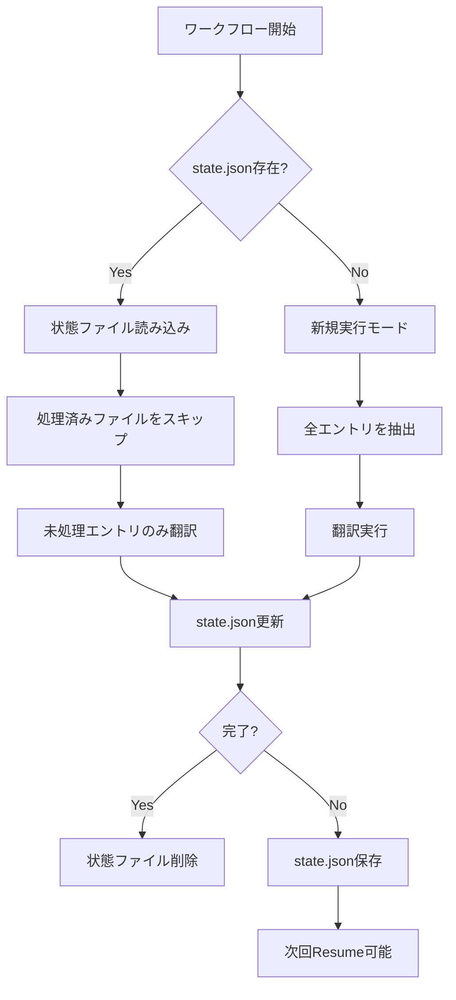
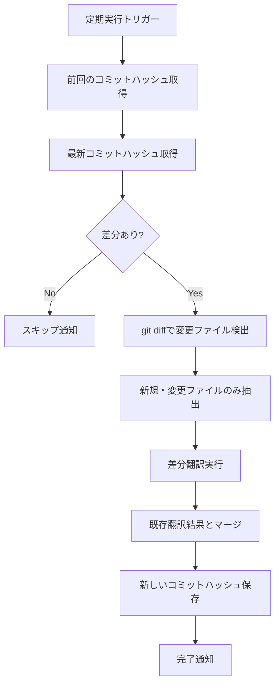

# 途中実行継続・定期更新チェック機能 - 仕様定義書 v2

## 目次

1. [背景・課題](#背景課題)
2. [要件定義](#要件定義)
3. [機能仕様](#機能仕様)
4. [成果物管理戦略](#成果物管理戦略)
5. [データ構造](#データ構造)
6. [実装計画](#実装計画)
7. [運用シナリオ](#運用シナリオ)

---

## 背景・課題

### 現状の問題点

1. **途中実行の非継続性**
   - レート制限でワークフローが停止した場合、最初からやり直しになる
   - 翻訳済みエントリが無駄になり、コスト・時間が倍増
   - GitHub Actionsの実行時間制限（6時間）に達するリスク

2. **定期更新の非対応**
   - OSSリポジトリの更新を手動で検知する必要がある
   - 新規コミット・差分翻訳のワークフローがない
   - 翻訳済みファイルが古くなるリスク

3. **トークン超過エントリの未処理**
   - 2,500トークン超過エントリは`unprocessed.jsonl`に残り続ける
   - Fallbackモデルでも処理されず、永久にスキップされる
   - 大規模なdocstringが翻訳されない問題

4. **状態管理の欠如**
   - 現在の処理位置を記録していない
   - 失敗原因の分析が困難
   - リトライ戦略が限定的

5. **成果物管理の課題**
   - `translate/`フォルダに実行結果が蓄積され、リポジトリが肥大化
   - Artifactsがワークフロー実行リポジトリに保存され、管理が煩雑
   - 翻訳結果を別リポジトリで閲覧したいニーズ（Fork戦略）

### 解決すべき課題

- ✅ **レジューム機能**: 途中停止した翻訳を継続できる
- ✅ **差分翻訳**: 新規追加・変更されたファイルのみを翻訳
- ✅ **定期実行**: スケジュール実行で自動的に更新をチェック
- ✅ **トークン超過処理**: Fallbackで大規模エントリを分割・処理
- ✅ **Fallback制御**: Fallback使用の有無を選択可能に
- ✅ **状態永続化**: 最小限の状態情報で再開・差分検知を実現
- ✅ **成果物管理**: 翻訳結果を専用リポジトリで管理（Fork戦略検討）

---

## 要件定義

### 機能要件

#### FR-1: 途中実行継続（Resume）

| ID | 要件 | 優先度 |
|----|------|--------|
| FR-1.1 | 前回の実行状態（処理済みファイル、最終行番号）を復元できる | High |
| FR-1.2 | 未処理エントリのみを再翻訳する | High |
| FR-1.3 | 処理済みエントリは再利用し、LLM呼び出しを回避する | High |
| FR-1.4 | 軽量な状態ファイル（state.json）を自動的に保存・読み込みする | High |
| FR-1.5 | 手動トリガーで途中実行を再開できる | Medium |

#### FR-2: トークン超過エントリの処理

| ID | 要件 | 優先度 |
|----|------|--------|
| FR-2.1 | 2,500トークン超過エントリをFallbackモデルで再試行する | High |
| FR-2.2 | Fallback失敗時は長文を分割して処理する | High |
| FR-2.3 | Fallback使用の有無をオプションで制御できる（`--no-fallback`） | Medium |
| FR-2.4 | unprocessed.jsonlの内容を次回実行時に自動リトライ | High |

#### FR-3: レート制限の監視

| ID | 要件 | 優先度 |
|----|------|--------|
| FR-3.1 | RPM（Requests Per Minute）を正確に監視・制御する | High |
| FR-3.2 | RPD（Requests Per Day）を追跡し、上限接近時に警告する | Medium |
| FR-3.3 | レート制限到達時に自動的にスリープする | Low |

#### FR-4: 差分翻訳（Incremental Translation）

| ID | 要件 | 優先度 |
|----|------|--------|
| FR-4.1 | 前回翻訳時のコミットハッシュを記録する | High |
| FR-4.2 | 新規追加ファイル・変更ファイルのみを抽出する | High |
| FR-4.3 | 削除されたファイルの翻訳結果を除外する | Medium |
| FR-4.4 | 変更がない場合はスキップする（no-op） | Medium |
| FR-4.5 | 既存翻訳結果をマージできる | High |

#### FR-5: 定期更新チェック（Scheduled Check）

| ID | 要件 | 優先度 |
|----|------|--------|
| FR-5.1 | cron式でスケジュール実行できる（例: 毎週月曜9:00） | High |
| FR-5.2 | 対象リポジトリの更新を検知できる | High |
| FR-5.3 | 更新がある場合のみ翻訳を実行する | High |
| FR-5.4 | 更新がない場合はスキップし、通知のみ行う | Medium |
| FR-5.5 | 複数リポジトリを管理できる | Low |

### 非機能要件

| ID | 要件 | 優先度 |
|----|------|--------|
| NFR-1 | 状態ファイルサイズ: 100KB以下（最小限の情報のみ） | High |
| NFR-2 | Resume機能のオーバーヘッド: 5秒以内 | Medium |
| NFR-3 | 差分検出の精度: 99%以上 | High |
| NFR-4 | 状態ファイルの破損時にフェイルセーフ動作 | High |
| NFR-5 | GitHub Actions Artifactsの保存期間: 90日 | Medium |

---

## 成果物管理戦略

### 現状の課題

**問題点:**
- `translate/`フォルダに翻訳結果が蓄積され、ワークフロー実行リポジトリが肥大化
- Artifactsがワークフロー実行リポジトリ配下に保存され、管理が煩雑
- 翻訳済みOSSを自然に閲覧したい（Forkリポジトリで見たい）

**現在の構造:**
```
MizuRyu/translate-oss-docstring-actions/  # ワークフロー実行リポジトリ
├── .github/workflows/
├── src/
├── translate/                            # ← 問題: ここに成果物が蓄積
│   ├── extracted.jsonl
│   ├── translated.jsonl
│   └── translated_sources/              # ← 大量のPythonファイル
└── ...
```

### 解決策: 3つの戦略

#### 戦略A: Artifacts専用管理（推奨 - ローカル実行向け）

**概要:**
- ローカル実行時は`out/`ディレクトリに出力
- GitHub Actions実行時はArtifactsのみで管理
- `translate/`フォルダは廃止または`.gitignore`に追加

**メリット:**
- ✅ リポジトリが肥大化しない
- ✅ 実装が最もシンプル
- ✅ ローカル開発とCI環境を分離できる

**デメリット:**
- ❌ Artifacts保持期間（90日）で古い翻訳結果が消える
- ❌ 翻訳結果をWebで直接閲覧できない

**実装:**
```yaml
# .github/workflows/translate.yml
jobs:
  translate:
    steps:
      - name: Translate
        run: |
          uv run python main.py translate out/extracted.jsonl \
            --output out/translated.jsonl

      - name: Upload Artifacts
        uses: actions/upload-artifact@v4
        with:
          name: translated-sources
          path: out/translated_sources/
          retention-days: 90
```

**`.gitignore`に追加:**
```
out/
translated/
*.jsonl
```

---

#### 戦略B: Fork Repository管理（将来検討 - 閲覧性重視）

**概要:**
- 対象OSSをForkしたリポジトリに翻訳結果をPush
- 翻訳済みコードをGitHub上で直接閲覧可能
- 例: `microsoft/agent-framework` → `MizuRyu/agent-framework-ja`

**メリット:**
- ✅ 翻訳結果をGitHub UIで自然に閲覧できる
- ✅ 他ユーザーと翻訳結果を共有しやすい
- ✅ 永続的な保存（Artifactsの90日制限なし）
- ✅ PRベースのレビューワークフローが可能

**デメリット:**
- ❌ Fork先リポジトリの管理コストが増加
- ❌ 上書きPushの衝突リスク（複数バージョン管理が必要）
- ❌ 実装が複雑（認証、ブランチ戦略、コンフリクト解決）

**実装イメージ:**
```yaml
# .github/workflows/translate.yml
jobs:
  translate:
    steps:
      - name: Clone Fork Repository
        run: |
          git clone https://github.com/MizuRyu/agent-framework-ja.git /tmp/fork

      - name: Apply Translations
        run: |
          # 翻訳結果をForkリポジトリにコピー
          rsync -av out/translated_sources/ /tmp/fork/python/

      - name: Commit and Push
        run: |
          cd /tmp/fork
          git config user.name "Translation Bot"
          git config user.email "bot@example.com"
          git checkout -b translations/$(date +%Y%m%d)
          git add -A
          git commit -m "feat: 日本語翻訳を追加 ($(date +%Y-%m-%d))"
          git push origin translations/$(date +%Y%m%d)
```

**課題:**
- **上書き問題**: 同じファイルを何度も翻訳すると、履歴が肥大化
- **バージョン管理**: 元リポジトリの更新とどう同期するか？
  - ブランチ戦略: `main`（元リポジトリ同期）、`ja/main`（翻訳版）
  - タグ管理: `v1.0.0-ja`のようなタグで翻訳バージョンを管理

---

#### 戦略C: GitHub Pages管理（中間案 - 静的サイト）

**概要:**
- 翻訳結果を静的サイトとしてGitHub Pagesで公開
- `gh-pages`ブランチに翻訳済みコードとドキュメントを配置

**メリット:**
- ✅ Web上で翻訳結果を閲覧可能
- ✅ 検索エンジンにインデックスされる
- ✅ カスタムドメイン設定が可能

**デメリット:**
- ❌ GitHub Pages用のビルド処理が必要
- ❌ コードの構造を静的サイト向けに変換する手間

---

### 推奨戦略: 段階的アプローチ

**Phase 1（現在）: Artifacts専用管理**
- ローカル実行: `out/`に出力、`.gitignore`で除外
- CI実行: Artifactsのみで管理
- `translate/`フォルダは廃止

**Phase 2（将来）: Fork Repository管理の検討**
- 需要があれば、Fork戦略を導入
- バージョン管理とブランチ戦略を整備
- 自動PR作成で翻訳結果をレビュー可能に

**実装方針:**
1. `.gitignore`に`out/`, `translated/`を追加
2. GitHub Actionsワークフローから`artifact_dir`を削除
3. Artifactsのみで成果物を管理
4. ローカル開発者は`out/`を自由に使用

---

## 機能仕様

### 1. Resume機能（途中実行継続）

#### 動作フロー



#### 軽量な状態ファイル構造（state.json）

**設計思想:**
- ❌ 全エントリの詳細を保存しない（肥大化防止）
- ✅ 処理済みファイルパスと最終行番号のみ記録
- ✅ 再開時は`extracted.jsonl`を再読み込みしてスキップ判定

```json
{
  "version": "1.0.0",
  "repository": {
    "url": "https://github.com/microsoft/agent-framework.git",
    "commit_hash": "abc123def456",
    "subdirectory": "python"
  },
  "execution": {
    "started_at": "2025-10-28T09:00:00Z",
    "updated_at": "2025-10-28T10:30:00Z",
    "status": "in_progress"
  },
  "progress": {
    "last_processed_file": "src/agents/_memory.py",
    "last_processed_line": 450,
    "total_files_processed": 75,
    "completion_percentage": 75.0
  },
  "metadata": {
    "total_tokens_used": 500000,
    "total_requests": 250,
    "fallback_count": 10
  }
}
```

**サイズ削減:**
- 従来想定: 10MB（全エントリ詳細）
- 新設計: **100KB以下**（ファイルパスと行番号のみ）

---

### 2. トークン超過エントリの処理

#### 現状の問題

```python
# src/translate.py (現在の実装)
if total_tokens > MAX_BATCH_TOKEN_LIMIT:
    # unprocessed.jsonlに書き出して終わり
    with failed_output.open("a", encoding="utf-8") as failed_handle:
        failed_handle.write(json.dumps(entry, ensure_ascii=False) + "\n")
    continue  # ← 永久にスキップされる
```

#### 改善案: Fallback再試行

```python
# src/translate.py (改善後)
if total_tokens > MAX_BATCH_TOKEN_LIMIT:
    logger.warning(
        f"エントリがトークン上限超過 (tokens={total_tokens}): "
        f"{entry['path']}:{entry['line_start']}"
    )
    
    # Fallback有効時は専用キューに追加
    if enable_fallback:
        oversized_entries.append(entry)
    else:
        # Fallback無効時はunprocessedに出力
        with failed_output.open("a", encoding="utf-8") as failed_handle:
            failed_handle.write(json.dumps(entry, ensure_ascii=False) + "\n")
    continue

# バッチ処理完了後、Fallbackで oversized_entries を処理
if oversized_entries:
    logger.info(f"トークン超過エントリをFallbackで処理: {len(oversized_entries)}件")
    for entry in oversized_entries:
        try:
            # 長文を分割して処理
            translated = await _translate_large_entry(entry, fallback_client)
            output_handle.write(json.dumps(translated, ensure_ascii=False) + "\n")
        except Exception as e:
            logger.error(f"Fallback処理失敗: {entry['path']}:{entry['line_start']} - {e}")
            with failed_output.open("a", encoding="utf-8") as failed_handle:
                failed_handle.write(json.dumps(entry, ensure_ascii=False) + "\n")
```

#### CLIオプション拡張

```bash
# Fallback有効（デフォルト）
uv run python main.py translate out/extracted.jsonl \
  --output out/translated.jsonl

# Fallback無効（トークン超過はスキップ）
uv run python main.py translate out/extracted.jsonl \
  --output out/translated.jsonl \
  --no-fallback
```

---

### 3. レート制限の監視

#### 現状確認

```python
# src/llm.py (現在の実装)
_GITHUB_MODEL_POLICIES: Dict[str, GithubModelPolicy] = {
    "openai/gpt-4.1": GithubModelPolicy(rpm=10, rpd=150, concurrency=2),
    "openai/gpt-4.1-mini": GithubModelPolicy(rpm=15, rpd=150, concurrency=5),
}
```

**実装状況:**
- ✅ RPM（Requests Per Minute）: `RequestRateLimiter`で制御中
- ✅ RPD（Requests Per Day）: データ構造には含まれているが、**実際の監視は未実装**
- ✅ 同時実行数: `ConcurrencyLimiter`で制御中

#### 改善案: RPD監視の追加

```python
# src/llm.py (改善後)
class DailyRequestTracker:
    """1日あたりのリクエスト数を追跡する"""
    
    def __init__(self, rpd_limit: int):
        self.rpd_limit = rpd_limit
        self.request_count = 0
        self.reset_date = datetime.now(timezone.utc).date()
    
    def check_and_increment(self) -> bool:
        """RPD上限チェック。上限到達ならFalseを返す"""
        current_date = datetime.now(timezone.utc).date()
        
        # 日付が変わったらリセット
        if current_date != self.reset_date:
            self.request_count = 0
            self.reset_date = current_date
        
        if self.request_count >= self.rpd_limit:
            logger.warning(f"RPD上限到達: {self.request_count}/{self.rpd_limit}")
            return False
        
        self.request_count += 1
        return True

# translate_batch内で使用
if not daily_tracker.check_and_increment():
    raise TranslationRequestError("RPD上限に到達しました。明日再実行してください。")
```

---

### 4. 差分翻訳（Incremental Translation）

#### 動作フロー



#### CLIコマンド拡張

```bash
# 差分抽出
uv run python main.py extract /path/to/repo \
  --output out/extracted.jsonl \
  --incremental \
  --base-commit abc123 \
  --current-commit def456

# 翻訳結果マージ
uv run python main.py merge \
  --base out/translated_full.jsonl \
  --incremental out/translated_incremental.jsonl \
  --output out/translated_merged.jsonl \
  --strategy replace  # replace | append | merge
```

---

### 5. 定期更新チェック（Scheduled Check）

#### GitHub Actions スケジュール実行

```yaml
name: Scheduled Translation Update

on:
  schedule:
    # 毎週月曜日 9:00 UTC (18:00 JST)
    - cron: '0 9 * * 1'
  workflow_dispatch:  # 手動実行も可能

env:
  TARGET_REPO: 'https://github.com/microsoft/agent-framework.git'
  SUBDIRECTORY: 'python'

jobs:
  check-updates:
    runs-on: ubuntu-latest
    outputs:
      has_changes: ${{ steps.check.outputs.has_changes }}
      current_commit: ${{ steps.check.outputs.current_commit }}
    steps:
      - name: Download previous state
        uses: actions/download-artifact@v4
        with:
          name: translation-metadata
          path: metadata/
        continue-on-error: true

      - name: Clone target repository
        run: |
          git clone --depth 50 ${{ env.TARGET_REPO }} /tmp/target-repo

      - name: Check for changes
        id: check
        run: |
          CURRENT_COMMIT=$(git -C /tmp/target-repo rev-parse HEAD)
          echo "current_commit=$CURRENT_COMMIT" >> $GITHUB_OUTPUT
          
          if [ -f "metadata/last_commit.txt" ]; then
            LAST_COMMIT=$(cat metadata/last_commit.txt)
            if [ "$LAST_COMMIT" == "$CURRENT_COMMIT" ]; then
              echo "has_changes=false" >> $GITHUB_OUTPUT
              echo "No changes detected."
            else
              echo "has_changes=true" >> $GITHUB_OUTPUT
              echo "Changes detected: $LAST_COMMIT -> $CURRENT_COMMIT"
            fi
          else
            echo "has_changes=true" >> $GITHUB_OUTPUT
            echo "First run, will translate all."
          fi

  translate:
    needs: check-updates
    if: needs.check-updates.outputs.has_changes == 'true'
    uses: ./.github/workflows/translate.yml
    with:
      repository_url: ${{ env.TARGET_REPO }}
      subdirectory: ${{ env.SUBDIRECTORY }}
      incremental: true
    secrets: inherit

  save-metadata:
    needs: [check-updates, translate]
    if: always()
    runs-on: ubuntu-latest
    steps:
      - name: Save commit hash
        run: |
          mkdir -p metadata
          echo "${{ needs.check-updates.outputs.current_commit }}" > metadata/last_commit.txt

      - name: Upload metadata
        uses: actions/upload-artifact@v4
        with:
          name: translation-metadata
          path: metadata/
          retention-days: 365  # 1年間保持
```

---

## データ構造

### 1. state.json（実行状態 - 軽量版）

```typescript
interface TranslationState {
  version: string;  // "1.0.0"
  repository: {
    url: string;
    commit_hash: string;
    subdirectory: string;
  };
  execution: {
    started_at: string;  // ISO 8601
    updated_at: string;
    status: "in_progress" | "completed" | "failed";
  };
  progress: {
    last_processed_file: string;  // 最後に処理したファイルパス
    last_processed_line: number;  // 最後に処理した行番号
    total_files_processed: number;
    completion_percentage: number;
  };
  metadata: {
    total_tokens_used: number;
    total_requests: number;
    fallback_count: number;
  };
}
```

**サイズ見積もり:**
- 1ファイルあたり: 約100バイト
- 1,000ファイルの場合: 約100KB
- **✅ 軽量化達成**

---

### 2. metadata.json（永続メタデータ）

```json
{
  "version": "1.0.0",
  "repository": "https://github.com/microsoft/agent-framework.git",
  "subdirectory": "python",
  "last_successful_run": {
    "commit_hash": "abc123def456",
    "completed_at": "2025-10-28T12:00:00Z",
    "total_entries": 1000
  },
  "history": [
    {
      "commit_hash": "xyz789abc012",
      "completed_at": "2025-10-21T12:00:00Z",
      "total_entries": 980
    }
  ]
}
```

---

## 実装計画

### Phase 1: 緊急対応（優先度: Critical）

**期間**: 3日

**タスク:**
1. ✅ `.gitignore`に`out/`, `translated/`を追加
2. ✅ GitHub Actionsワークフローから`artifact_dir`を削除
3. ✅ トークン超過エントリのFallback処理実装
4. ✅ `--no-fallback`オプション追加

**成果物:**
- 更新された`.gitignore`
- 更新された`.github/workflows/translate.yml`
- 拡張された`src/translate.py`

---

### Phase 2: Resume機能（優先度: High）

**期間**: 1週間

**タスク:**
1. ✅ `src/state.py`作成 - 軽量な状態管理ロジック
2. ✅ `src/translate.py`拡張 - Resume対応
3. ✅ CLI拡張 - `--resume`, `--state-file`オプション追加
4. ✅ ワークフロー拡張 - Artifacts保存/復元
5. ✅ テスト追加 - Resume機能のテスト

**成果物:**
- `src/state.py`
- 拡張された`src/translate.py`
- 更新されたCLI
- テストケース追加

---

### Phase 3: RPD監視（優先度: Medium）

**期間**: 3日

**タスク:**
1. ✅ `DailyRequestTracker`クラス実装
2. ✅ `src/llm.py`にRPD監視ロジック追加
3. ✅ RPD上限到達時の警告ログ
4. ✅ テスト追加

**成果物:**
- 拡張された`src/llm.py`
- RPD監視テスト

---

### Phase 4: 差分翻訳（優先度: Medium）

**期間**: 1週間

**タスク:**
1. ✅ `src/incremental.py`作成 - 差分検出ロジック
2. ✅ `src/extract.py`拡張 - `--incremental`対応
3. ✅ `src/merge.py`作成 - 翻訳結果マージ
4. ✅ CLI拡張 - `merge`サブコマンド追加
5. ✅ テスト追加

**成果物:**
- `src/incremental.py`
- `src/merge.py`
- 更新されたCLI

---

### Phase 5: 定期実行（優先度: Low）

**期間**: 3日

**タスク:**
1. ✅ `.github/workflows/scheduled-translation.yml`作成
2. ✅ メタデータ管理ロジック実装
3. ✅ 通知機能実装（Slack, GitHub Issues）
4. ✅ ドキュメント更新

**成果物:**
- `.github/workflows/scheduled-translation.yml`
- 更新されたREADME.md

---

## 運用シナリオ

### シナリオ1: 大規模リポジトリの初回翻訳（Resume機能）

**状況:**
- ファイル数: 5,000
- 推定時間: 10時間
- レート制限到達の可能性: 高

**対応:**
1. 初回実行で5時間後にレート制限到達
2. `state.json`が自動保存される（処理済み: 2,500ファイル）
3. 翌日、`--resume`で再実行
4. 残り2,500ファイルを処理して完了

**ワークフロー:**
```bash
# Day 1
uv run python main.py translate out/extracted.jsonl \
  --output out/translated.jsonl \
  --state-file out/state.json
# → 5時間後にレート制限でストップ、state.json保存

# Day 2
uv run python main.py translate out/extracted.jsonl \
  --output out/translated.jsonl \
  --resume \
  --state-file out/state.json
# → 処理済み2,500ファイルをスキップ、残り2,500ファイルを翻訳
```

---

### シナリオ2: トークン超過エントリのFallback処理

**状況:**
- 大規模なdocstring（10,000トークン）が存在
- Primary/Secondaryモデルでは2,500トークン超過

**対応:**
```bash
# Fallback有効（デフォルト）
uv run python main.py translate out/extracted.jsonl \
  --output out/translated.jsonl
# → トークン超過エントリをFallbackで分割処理

# Fallback無効（スキップ）
uv run python main.py translate out/extracted.jsonl \
  --output out/translated.jsonl \
  --no-fallback
# → トークン超過エントリはunprocessed.jsonlに出力
```

**処理フロー:**
1. Primary（gpt-4.1）で試行 → トークン超過
2. Fallback有効の場合:
   - 長文を3,000文字ごとに分割
   - 各チャンクをFallbackモデルで翻訳
   - 翻訳結果を結合
3. Fallback無効の場合:
   - `unprocessed.jsonl`に出力

---

### シナリオ3: 定期的な差分更新

**状況:**
- 対象: microsoft/agent-framework
- スケジュール: 毎週月曜9:00
- 週次更新: 平均50ファイル

**対応:**
1. **月曜9:00**: Scheduled workflowが起動
2. **差分検出**: 前回コミット vs 最新コミット
3. **変更あり**: 50ファイルの差分翻訳を実行
4. **マージ**: 既存翻訳結果とマージ
5. **Artifacts保存**: 更新された翻訳結果を保存

---

## まとめ

### 重要な変更点

1. **成果物管理**: `translate/`フォルダ廃止、Artifacts専用管理（Phase 1で対応）
2. **軽量状態管理**: state.jsonサイズを10MB→100KB以下に削減
3. **トークン超過処理**: Fallback再試行機能の追加（`--no-fallback`オプション）
4. **RPD監視**: 実装は後回し（Phase 3）、現状はRPMとconcurrencyのみ

### 実装優先度

1. **Phase 1（緊急）**: `.gitignore`更新、トークン超過Fallback - **3日**
2. **Phase 2（高）**: Resume機能 - **1週間**
3. **Phase 3（中）**: RPD監視 - **3日**
4. **Phase 4（中）**: 差分翻訳 - **1週間**
5. **Phase 5（低）**: 定期実行 - **3日**

### Fork Repository管理は将来検討

**現時点では保留:**
- Artifacts専用管理で十分
- Fork戦略は需要があれば後で追加
- 実装コストが高いため、まずはコア機能を優先

### 次のステップ

1. **Phase 1の実装開始**: `.gitignore`更新とトークン超過Fallback
2. 仕様書のレビュー・フィードバック
3. 実装完了後、README.mdの更新

#### 動作フロー


#### 差分検出ロジック

```bash
# 1. 前回翻訳時のコミットハッシュを取得
LAST_COMMIT=$(cat out/last_commit.txt)

# 2. 最新コミットハッシュを取得
CURRENT_COMMIT=$(git -C /tmp/target-repo rev-parse HEAD)

# 3. 差分がない場合はスキップ
if [ "$LAST_COMMIT" == "$CURRENT_COMMIT" ]; then
  echo "No changes detected. Skipping translation."
  exit 0
fi

# 4. 変更ファイルリストを取得
git -C /tmp/target-repo diff --name-only $LAST_COMMIT $CURRENT_COMMIT \
  | grep '\.py$' > out/changed_files.txt

# 5. 変更ファイルのみ抽出
uv run python main.py extract /tmp/target-repo/python \
  --output out/extracted_incremental.jsonl \
  --include-only-files out/changed_files.txt

# 6. 差分翻訳
uv run python main.py translate out/extracted_incremental.jsonl \
  --output out/translated_incremental.jsonl

# 7. マージ
uv run python main.py merge \
  --base out/translated_full.jsonl \
  --incremental out/translated_incremental.jsonl \
  --output out/translated_merged.jsonl

# 8. 新しいコミットハッシュを保存
echo "$CURRENT_COMMIT" > out/last_commit.txt
```

#### CLIコマンド拡張

```bash
# 差分抽出
uv run python main.py extract /path/to/repo \
  --output out/extracted.jsonl \
  --incremental \
  --base-commit abc123 \
  --current-commit def456

# 翻訳結果マージ
uv run python main.py merge \
  --base out/translated_full.jsonl \
  --incremental out/translated_incremental.jsonl \
  --output out/translated_merged.jsonl \
  --strategy replace  # replace | append | merge
```

---

### 3. 定期更新チェック（Scheduled Check）

#### GitHub Actions スケジュール実行

```yaml
name: Scheduled Translation Update

on:
  schedule:
    # 毎週月曜日 9:00 UTC (18:00 JST)
    - cron: '0 9 * * 1'
  workflow_dispatch:  # 手動実行も可能

env:
  TARGET_REPO: 'https://github.com/microsoft/agent-framework.git'
  SUBDIRECTORY: 'python'

jobs:
  check-updates:
    runs-on: ubuntu-latest
    outputs:
      has_changes: ${{ steps.check.outputs.has_changes }}
      current_commit: ${{ steps.check.outputs.current_commit }}
    steps:
      - name: Download previous state
        uses: actions/download-artifact@v4
        with:
          name: translation-metadata
          path: metadata/
        continue-on-error: true

      - name: Clone target repository
        run: |
          git clone --depth 50 ${{ env.TARGET_REPO }} /tmp/target-repo

      - name: Check for changes
        id: check
        run: |
          CURRENT_COMMIT=$(git -C /tmp/target-repo rev-parse HEAD)
          echo "current_commit=$CURRENT_COMMIT" >> $GITHUB_OUTPUT
          
          if [ -f "metadata/last_commit.txt" ]; then
            LAST_COMMIT=$(cat metadata/last_commit.txt)
            if [ "$LAST_COMMIT" == "$CURRENT_COMMIT" ]; then
              echo "has_changes=false" >> $GITHUB_OUTPUT
              echo "No changes detected."
            else
              echo "has_changes=true" >> $GITHUB_OUTPUT
              echo "Changes detected: $LAST_COMMIT -> $CURRENT_COMMIT"
            fi
          else
            echo "has_changes=true" >> $GITHUB_OUTPUT
            echo "First run, will translate all."
          fi

      - name: Create summary
        run: |
          echo "## Update Check Result" >> $GITHUB_STEP_SUMMARY
          echo "- Target: ${{ env.TARGET_REPO }}" >> $GITHUB_STEP_SUMMARY
          echo "- Current Commit: ${{ steps.check.outputs.current_commit }}" >> $GITHUB_STEP_SUMMARY
          echo "- Has Changes: ${{ steps.check.outputs.has_changes }}" >> $GITHUB_STEP_SUMMARY

  translate:
    needs: check-updates
    if: needs.check-updates.outputs.has_changes == 'true'
    uses: ./.github/workflows/translate.yml
    with:
      repository_url: ${{ env.TARGET_REPO }}
      subdirectory: ${{ env.SUBDIRECTORY }}
      incremental: true
      base_commit: ${{ needs.check-updates.outputs.last_commit }}
    secrets: inherit

  save-metadata:
    needs: [check-updates, translate]
    if: always()
    runs-on: ubuntu-latest
    steps:
      - name: Save commit hash
        run: |
          mkdir -p metadata
          echo "${{ needs.check-updates.outputs.current_commit }}" > metadata/last_commit.txt

      - name: Upload metadata
        uses: actions/upload-artifact@v4
        with:
          name: translation-metadata
          path: metadata/
          retention-days: 365  # 1年間保持
```

#### 通知機能

```yaml
  notify:
    needs: [check-updates, translate]
    if: always()
    runs-on: ubuntu-latest
    steps:
      - name: Notify Slack
        if: needs.check-updates.outputs.has_changes == 'true'
        uses: slackapi/slack-github-action@v1
        with:
          webhook-url: ${{ secrets.SLACK_WEBHOOK_URL }}
          payload: |
            {
              "text": "Translation Update Completed",
              "blocks": [
                {
                  "type": "section",
                  "text": {
                    "type": "mrkdwn",
                    "text": "*Translation Update*\n• Repository: ${{ env.TARGET_REPO }}\n• Status: ${{ job.status }}\n• Commit: ${{ needs.check-updates.outputs.current_commit }}"
                  }
                }
              ]
            }

      - name: Create Issue on Failure
        if: failure()
        uses: actions/github-script@v7
        with:
          script: |
            github.rest.issues.create({
              owner: context.repo.owner,
              repo: context.repo.repo,
              title: '🚨 Scheduled Translation Failed',
              body: `Translation update failed for ${process.env.TARGET_REPO}\n\nWorkflow: ${context.serverUrl}/${context.repo.owner}/${context.repo.repo}/actions/runs/${context.runId}`,
              labels: ['automation', 'translation', 'failure']
            })
```

---

## 実現構想案

### 案1: GitHub Actions Artifacts ベース（推奨）

**メリット:**
- ✅ 追加インフラ不要（GitHub Actionsのみで完結）
- ✅ シンプルな実装
- ✅ 無料（GitHub Freeでも利用可能）
- ✅ 保持期間90日〜365日設定可能

**デメリット:**
- ❌ Artifactsのダウンロード/アップロードが必要
- ❌ 大規模プロジェクトではサイズ制限に注意
- ❌ 複数ワークフロー間での状態共有が複雑

**適用シーン:**
- 中小規模プロジェクト（1,000ファイル以下）
- 単一リポジトリの翻訳

---

### 案2: GitHub Issues/Gist ベース

**メリット:**
- ✅ 永続的なストレージ
- ✅ バージョン履歴が自動記録
- ✅ WebUIで状態確認が容易

**デメリット:**
- ❌ API制限がある
- ❌ 大量データには不向き
- ❌ セキュリティ面で注意が必要（public gist）

**適用シーン:**
- メタデータのみの保存（コミットハッシュ、実行履歴）
- 軽量な状態管理

---

### 案3: 外部ストレージ（S3/Azure Blob）ベース

**メリット:**
- ✅ 大規模データに対応
- ✅ 高速なアクセス
- ✅ 長期保存が可能

**デメリット:**
- ❌ 外部サービスの設定が必要
- ❌ コストが発生
- ❌ 認証情報の管理が必要

**適用シーン:**
- 大規模プロジェクト（10,000ファイル以上）
- エンタープライズ利用

---

### 推奨構成（ハイブリッド）

```
状態管理:
├─ GitHub Artifacts: 翻訳結果（JSONL）、state.json（90日保持）
├─ GitHub Gist: メタデータ（コミットハッシュ、実行履歴）
└─ Repository Secrets: 認証情報

通知:
├─ GitHub Actions Summary: 実行結果サマリ
├─ Slack Webhook: 成功/失敗通知
└─ GitHub Issues: エラーレポート自動作成
```

---

## データ構造

### 1. state.json（実行状態）

```typescript
interface TranslationState {
  version: string;  // "1.0.0"
  repository: {
    url: string;
    commit_hash: string;
    subdirectory: string;
  };
  execution: {
    workflow_run_id: string;
    started_at: string;  // ISO 8601
    updated_at: string;
    status: "in_progress" | "completed" | "failed";
  };
  progress: {
    total_entries: number;
    processed_entries: number;
    failed_entries: number;
    skipped_entries: number;
    completion_percentage: number;
  };
  processed_files: ProcessedFile[];
  failed_entries: FailedEntry[];
  metadata: {
    total_tokens_used: number;
    total_requests: number;
    fallback_count: number;
  };
}

interface ProcessedFile {
  path: string;
  entries_count: number;
  translated_at: string;
  checksum: string;  // SHA-256
}

interface FailedEntry {
  path: string;
  kind: "docstring" | "comment" | "log_message";
  line_start: number;
  error: string;
  attempts: number;
}
```

### 2. metadata.json（永続メタデータ）

```json
{
  "version": "1.0.0",
  "repository": "https://github.com/microsoft/agent-framework.git",
  "subdirectory": "python",
  "last_successful_run": {
    "commit_hash": "abc123def456",
    "workflow_run_id": "1234567890",
    "completed_at": "2025-10-28T12:00:00Z",
    "total_entries": 1000,
    "artifacts_url": "https://github.com/.../actions/runs/1234567890"
  },
  "history": [
    {
      "commit_hash": "xyz789abc012",
      "completed_at": "2025-10-21T12:00:00Z",
      "total_entries": 980
    }
  ]
}
```

---

## 実装計画

### Phase 1: Resume機能（優先度: High）

**期間**: 2週間

**タスク:**
1. ✅ `src/state.py`作成 - 状態管理ロジック
2. ✅ `src/translate.py`拡張 - Resume対応
3. ✅ CLI拡張 - `--resume`, `--state-file`オプション追加
4. ✅ ワークフロー拡張 - Artifacts保存/復元
5. ✅ テスト追加 - Resume機能のテスト

**成果物:**
- `src/state.py`
- 拡張された`src/translate.py`
- 更新された`.github/workflows/translate.yml`
- テストケース追加

---

### Phase 2: 差分翻訳（優先度: Medium）

**期間**: 1週間

**タスク:**
1. ✅ `src/incremental.py`作成 - 差分検出ロジック
2. ✅ `src/extract.py`拡張 - `--incremental`対応
3. ✅ `src/merge.py`作成 - 翻訳結果マージ
4. ✅ CLI拡張 - `merge`サブコマンド追加
5. ✅ テスト追加 - 差分翻訳のテスト

**成果物:**
- `src/incremental.py`
- `src/merge.py`
- 更新されたCLI

---

### Phase 3: 定期実行（優先度: Medium）

**期間**: 1週間

**タスク:**
1. ✅ `.github/workflows/scheduled-translation.yml`作成
2. ✅ メタデータ管理ロジック実装
3. ✅ 通知機能実装（Slack, GitHub Issues）
4. ✅ ドキュメント更新
5. ✅ E2Eテスト

**成果物:**
- `.github/workflows/scheduled-translation.yml`
- 更新されたREADME.md

---

## 運用シナリオ

### シナリオ1: 大規模リポジトリの初回翻訳

**状況:**
- ファイル数: 5,000
- 推定時間: 10時間
- レート制限到達の可能性: 高

**対応:**
1. 初回実行で5時間後にレート制限到達
2. `state.json`が自動保存される（処理済み: 2,500エントリ）
3. 翌日、`--resume`で再実行
4. 残り2,500エントリを処理して完了

**ワークフロー:**
```bash
# Day 1
uv run python main.py translate out/extracted.jsonl \
  --output out/translated.jsonl \
  --state-file out/state.json
# → 5時間後にレート制限でストップ、state.json保存

# Day 2
uv run python main.py translate out/extracted.jsonl \
  --output out/translated.jsonl \
  --resume \
  --state-file out/state.json
# → 処理済み2,500件をスキップ、残り2,500件を翻訳
```

---

### シナリオ2: 定期的な差分更新

**状況:**
- 対象: microsoft/agent-framework
- スケジュール: 毎週月曜9:00
- 週次更新: 平均50ファイル

**対応:**
1. **月曜9:00**: Scheduled workflowが起動
2. **差分検出**: 前回コミット vs 最新コミット
3. **変更あり**: 50ファイルの差分翻訳を実行
4. **マージ**: 既存翻訳結果とマージ
5. **通知**: Slackに完了通知

**ワークフロー:**
```yaml
# 毎週月曜9:00に自動実行
schedule:
  - cron: '0 9 * * 1'

# 差分検出 → 翻訳 → マージ → 通知
```

---

### シナリオ3: 手動での差分翻訳

**状況:**
- 急ぎで特定コミットの差分を翻訳したい

**対応:**
```bash
# 1. 差分抽出
uv run python main.py extract /path/to/repo \
  --output out/extracted_incremental.jsonl \
  --incremental \
  --base-commit abc123 \
  --current-commit def456

# 2. 差分翻訳
uv run python main.py translate out/extracted_incremental.jsonl \
  --output out/translated_incremental.jsonl

# 3. マージ
uv run python main.py merge \
  --base out/translated_full.jsonl \
  --incremental out/translated_incremental.jsonl \
  --output out/translated_merged.jsonl

# 4. 反映
uv run python main.py replace out/translated_merged.jsonl \
  --output-dir out/translated_sources \
  --root /path/to/repo
```

---

## まとめ

### 実装優先度

1. **Phase 1: Resume機能** - 最優先（レート制限対策）
2. **Phase 2: 差分翻訳** - 中優先（効率化）
3. **Phase 3: 定期実行** - 中優先（自動化）

### 推奨構成

- **状態管理**: GitHub Artifacts（90日保持）
- **メタデータ**: GitHub Gist（永続保存）
- **通知**: Slack + GitHub Issues

### 次のステップ

1. この仕様書のレビュー
2. Phase 1（Resume機能）の実装開始
3. PoC（Proof of Concept）の実施
